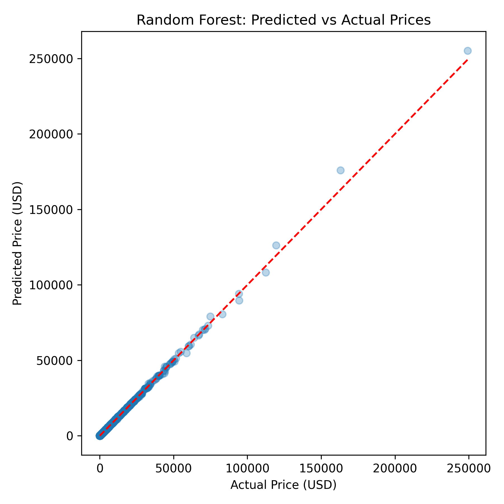
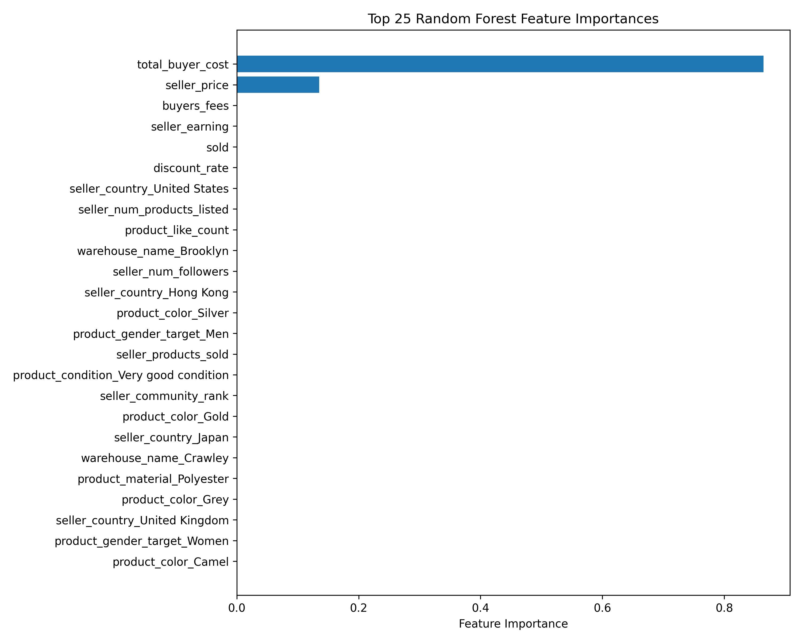

<link rel="stylesheet" href="style.css">

[Home](index.md) · [Dashboards](dashboards.html) · [Model](model.md) · [EDA](eda.md) 

# Predictive Modeling

## Predictive Modeling Overview Presentation

  <iframe 
    src="https://docs.google.com/presentation/d/1zvjWmNPffg9PcWgfTFc0TbdyNjtHPv3zEWCVaFXvbGM/embed?start=false&loop=false&delayms=3000"
    frameborder="0"
    width="960"
    height="569"
    allowfullscreen="true"
    mozallowfullscreen="true"
    webkitallowfullscreen="true">
  </iframe>

## Code Files
## Full Modeling Notebook (Embedded)

  <iframe 
    src="https://nbviewer.org/github/rsm-msba-25-26/vestiaire-mgta452/blob/main/code/predictive_modeling.ipynb"
    width="100%"
    height="900"
    style="border:none;">
  </iframe>

## Code File (GitHub)

- [Predictive Modeling Notebook (.ipynb)](https://github.com/rsm-msba-25-26/vestiaire-mgta452/blob/main/code/predictive_modeling.ipynb)

  
## Predictions vs Actual (Random Forest)

## Feature Importance (Random Forest)

